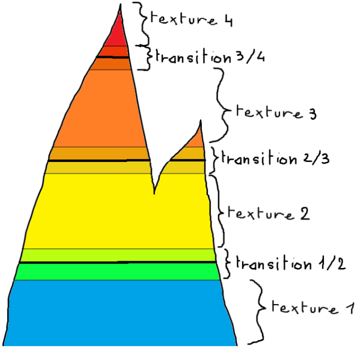
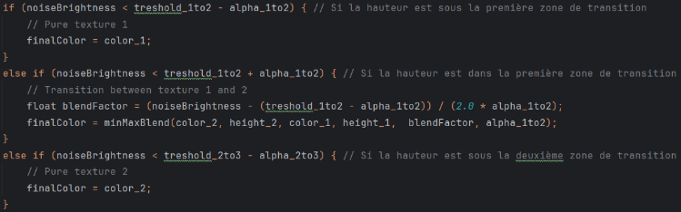

# 2ème jalon
## Attendu du jalon

Pour ce deuxième jalon d'A3D, nous avons réalisé shader Mix Max en plus de quelques améliorations.

### Explication du Mix Max:
L’objectif du Mix Max est de séparer un objet 3D en différentes zones en fonction de sa hauteur, chaque zone ainsi définie a une texture associée. Ces zones doivent transitionner de manière fluide entre elles.

On commence par le vertex shader, celui-ci va préparer les données géométriques puis les passer au fragment shader.
Le vertex shader récupère un uScale et l’applique à sa composante verticale (sur l’axe Z), afin de contrôler la hauteur du rendu.

Ce vecteur est ensuite passé en vecteur à 4 dimensions avec w = 1 et est transformé pour obtenir la position finale des vertex.
On calcule ensuite le vecteur normal afin de le transmettre au fragment shader avec les coordonnées des textures

On a ensuite le fragment shader, c’est dans celui-ci que se passe la majorité des calcules:

On lui donne les textures à mélanger, leurs cartes de priorités, la heightmap qui sert à construire notre terrain et qui nous permet de savoir où placer les transitions (il est donc important que cette heightmap soit effectivement la même que le terrain pour un effet convaincant) ainsi que les hauteurs et amplitudes de ces transitions.
Ce shader applique les textures données dans les zones appropriées et crée une transition entre ces zones pour un rendu propre.

Pour les transitions, on a créé une fonction de blending qui calcule la couleur en fonction de la hauteur.
On finit en ajoutant un niveau 0 correspondant au niveau de l’eau. Autrement dit, on a une texture d’eau présente par défaut séparée non seulement par le blending mais aussi par un plan 3D plan texturé par de l’eau.
On a créé des sliders pour jouer avec différents paramètres, notamment les textures ou les hauteurs et espaces de transitions.
